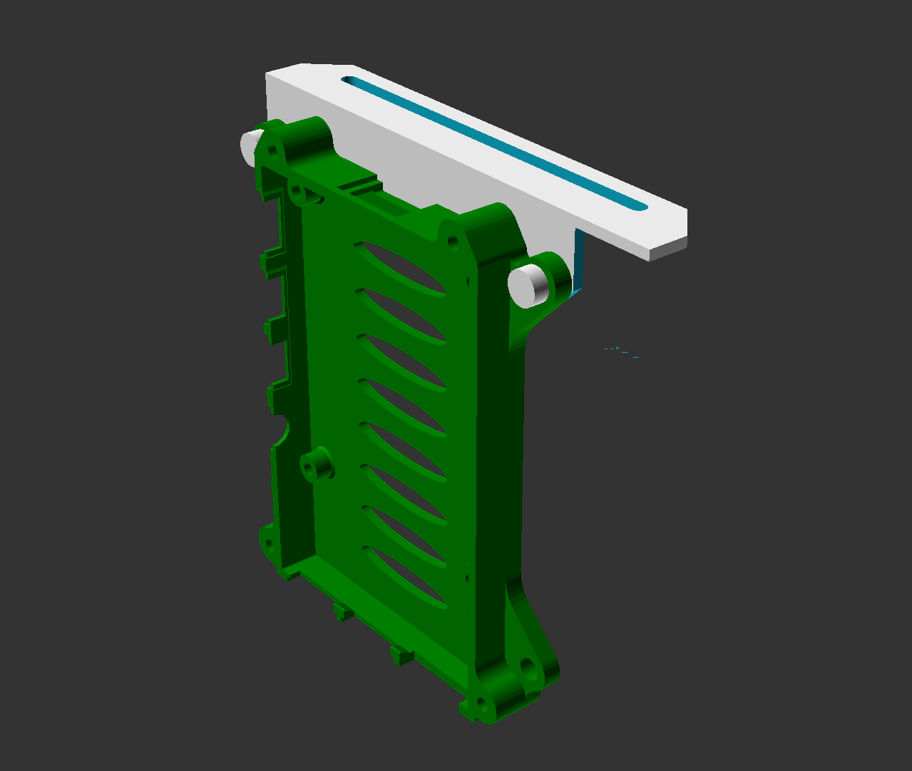

# RPi4 Case Holder for Monoprice Select Mini

Mounting profile for Raspberry Pi 4 Case on Monoprice Mini Select (v2)
Printed succesfully!! :)

The case for the Raspberry Pi 4 can be found here https://www.thingiverse.com/thing:3714695

 

 

 

 

 

 

 

# LICENSE

<dl>
 Dieses Werk ist lizenziert unter einer <a rel="license" href="http://creativecommons.org/licenses/by/4.0/">Creative Commons Namensnennung 4.0 International Lizenz</a>.
</dl>

<dl>
 This work is licensed under a <a rel="license" href="http://creativecommons.org/licenses/by/4.0/">Creative Commons Attribution 4.0 International License</a>.
</dl>
